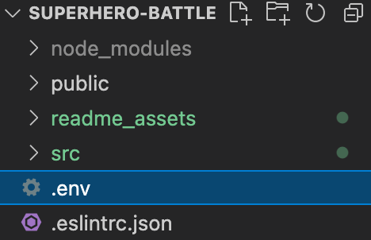
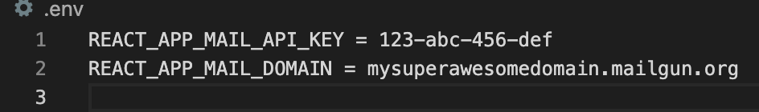

# Superhero Battle - Frontend
This is the repository for the "Superhero Battle" frontend. The instructions on how to run this project and the description of its features can be found in the following sections.

# Project setup and running

## Preconditions

To run both this project and its backend, you need to have Node installed (version 13.11 and above recommended).
### Running the backend
As mentioned before, this repository consists of the frontend for the "Superhero Battle" application. Therefore, a precondition to be able to run this project is having its backend running, [whose repository can be found here](https://github.com/Snorlax8/superhero-battle-backend).

By default, the backend runs in the port 8000. If, by any reason, you decide to change this port, you will have to change the `BACKEND_URL` variable accordingly, which is found in the `superhero-battle/src/constants.js` file.

### Environment variables

To be able to send mails, this project uses [Mailgun](https://www.mailgun.com/). If you want to send an email, you will have to create a free account in Mailgun and setup a domain. It is important to notice that you can only send mails to authorized recipients in your domain.

Then, you need to create an environment file called `.env` and place it in the root folder (`superhero-battle`) of the project. Therefore, the path to the environment file should look like this: `superhero-battle/.env`.



There are two environment variables that need to go in the `.env` file:
- `REACT_APP_MAIL_DOMAIN`
- `REACT_APP_MAIL_API_KEY`

The `REACT_APP_MAIL_DOMAIN` needs to be assigned to the domain you set up at Mailgun, and its corresponding API key needs to be assigned to the `REACT_APP_MAIL_API_KEY`. 

Then, your `.env` file will look something like this:



## Running the project

After you have created the `.env` file, the first step is running the following command:

```
npm install
```

Then, you can run the project by doing:
```
npm run start
```

The project will be running in the port 3000.

## Project features

The "Superhero Battle" application allows you to see a battle unfold between two teams of heroes. A battle consists of at least one fight round. Once the teams are formed, you will have the option to start a fight round, and you will be able to keep doing this until a team is declared as the winner, ending the battle.

Once a battle is over (i.e., a team has won), you will be presented three different options:
- **Send mail**: input an email of your choice (remember that it needs to be an authorized recipient of your Mailgun domain) and receive a summary of the battle. This summary includes the name of the heroes that fought for each team and the team that was declared a winner.

- **Start another battle with the same heroes**: all the heroes will be healed and you'll regain the option to start a fight round.

- **Start another battle with different heroes**: new teams will be formed and you'll be able to start a fight round.

## Considerations taken

- A hero whose alignment is 'neutral' is considered to be 'good'.

- Any 'null' stat of a hero is replaced by a random number between 0 and 100.

- To form the teams, a set of 10 unique numbers is generated. These numbers correspond to the IDs of the heroes that will be fetched from the [Superhero API](https://superheroapi.com/). The heroes fetched are stored in an array which is divided in half to form both teams, which will be referred as "first team" and "second team" from now on.

- In a fight round, the battle between the teams is not simultaneous. When a fight round begins, a random number (either 0 or 1) is generated to determine which team gets to attack first. If the random number equals 0, the first team attacks first. Otherwise, the second team attacks first. After the first attack of the round is over, the attacked heroes' health points (HP) are updated accordingly. Only the heroes that are still standing (HP > 0) will be able to participate in the second attack of the round. 
